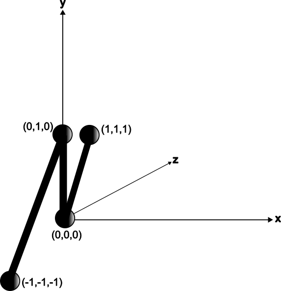

# Rusty RNA (RRNA)

RRNA is a CAD tool for designing RNA structures, in 2D or 3D, written in Rust.

As it is currently being developped, it has no useful features yet. However it aims to achieve or implement the following

- [ ] Easy to use GUI
- [ ] Accurate RNA structure prediction
- [ ] Fast RNA sequence generation
- [x] Enable imports from RRNA file instead of requiring editor
- [x] Export schematics to RRNA file
- [ ] Produce RNA sequence as text, illustrative diagram, and interaction diagrams

## TODO
- [ ] Split schematic to a single path
- [ ] Turn 3D schematic to 2D schematic
- [ ] Turn path to RNA sequence
- [ ] Turn schematic to interaction diagram

## Documentation

### RRNA File Syntax

RRNA files use the Rusty Object Notation (RON), and are effectively the serialised version of the `Graph` object representing your structure. As such, they start with `(` and end with `)`.

Within these brackets, there are two components: `vertices` and `edges`, where `vertices` is an array of all the vertices, and `edges` is an array of all the edges. The RRNA notation for a vertex follows the form:
```
(
    position: (x, y),
    class: Class,
    connections: Number of connections
)
```
And the RRNA notation for an edge has the form:
```

(
    origin: Index of origin vertex
    destination: Index of destination vertex
    length: Distance between origin and destination
)
```

Therefore, a structure with 4 vertices of which the type is unknown, layed out as shown in the following diagram:



Would be written as such in the RRNA file:

```
(
    vertices: [
        (
            position: (0.0, 0.0, 0.0),
            class: Unknown,
            connections: 2,
        ),
        (
            position: (1.0, 1.0, 1.0),
            class: Unknown,
            connections: 1,
        ),
        (
            position: (-1.0, -1.0, -1.0),
            class: Unknown,
            connections: 1,
        ),
        (
            position: (0.0, 1.0, 0.0),
            class: Unknown,
            connections: 2,
        ),
    ],
    edges: [
        (
            origin: 0,
            destination: 1,
            length: 1.7320508,
        ),
        (
            origin: 0,
            destination: 3,
            length: 1.0,
        ),
        (
            origin: 2,
            destination: 3,
            length: 2.4494898,
        ),
    ],
)
```